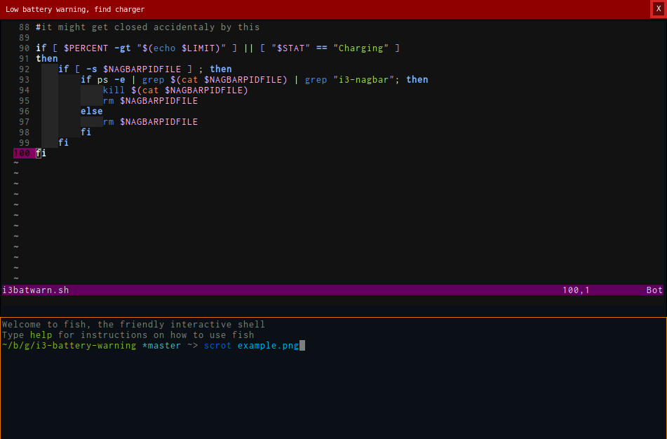

i3-battery-warning
==================

This is a simple battery warning script. It uses i3's nagbar to display warnings.

Let this script run as a cronjob.

Open your crontab.

$ crontab -e

Add the following line to check battery status every minute

*/1 * * * * /PATH/TO/YOUR/SCRIPT/i3batwarn.sh

If the need to trouble shoot arises one could pipe the cron job output to a file like

*/1 * * * * /PATH/TO/YOUR/SCRIPT/i3batwarn.sh > /tmp/batterywarn.log

If the script only works when invoked from terminal and not as a cronjob it might help to specify

DISPLAY=:0

in the cron tab (before calling this script).

screenshot
==========

fork changes
============

Added a pidfile where the pid of each (one max) nagbar is saved
and a check to kill the nagbar if the battery is above the limit.
This usually works but sometimes the nagbar has to be closed manually.
